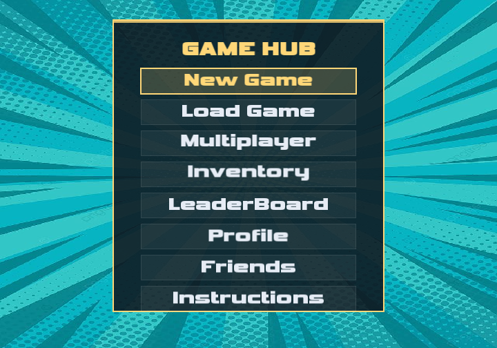

# Xonic Multiplayer Arcade Platform

Xonic is a C++ and SFML territory-capture arcade platform with single-player and multiplayer modes, account management, matchmaking, social features, saved progress, and selectable visual themes.



## Features

- Single-player and local multiplayer gameplay
- Registration and login
- Priority-queue matchmaking
- Min-heap leaderboard
- Friend search, requests, and friend lists
- Player profiles and match history
- AVL-tree-backed theme inventory
- Save and load support

## Tech Stack

C++17, SFML 2.6, object-oriented programming, custom data structures

## Run on macOS

```bash
make
make run
```

The repository includes the SFML 2.6 runtime files required by the existing build. Generated Visual Studio output and local player files are excluded from Git.

## Demo Accounts

The included CSV contains fictional demo users only. Use `player_one` with password `arcade123`, or register a new local account.

